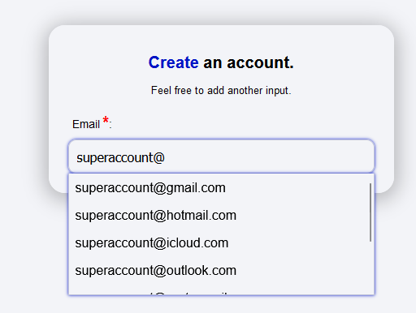

# Very easy input email suggestion in Vanilla JS.

This project provides a simple way to suggest email addresses as users type in an input field using Vanilla JavaScript. It enhances user experience by offering autocomplete suggestions, making it easier and faster to fill out email fields.

## JS Settings:

You just need to set "sdev-email-suggestion" for all the email input you want.

Ex : `<input  class = "inpt" id = "registerEmail" placeholder="email@domain.com" type="text" maxlength="255" name = "register-email" required sdev-email-suggestion/>`

## Exemple:

## Compatibility:

| | Chrome | Safari | Edge | Firefox | Brave | Opera |
| ------------- | ----------- | ----------- | ---------- | ----------- | ----------- | ---------- |
| Compatibility | ✅ Working  | ✅ Working | ✅ Working | ✅ Working | ✅ Working | ✅ Working |

## Licence:

You can use this code to do absolutely whatever you want. 

## Contact:

If you have any questions or need the services of a full-stack developer, feel free to contact me at: pierre.lebret@spunky.dev.